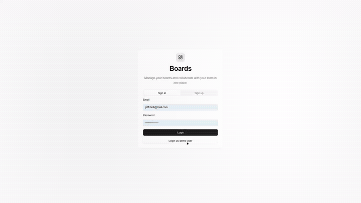

# Boards Frontend Angular

Angular app for the Boards Backend. This is the Angular version of the Boards frontend, built with standalone Angular routes, an Orval-generated API client, authenticated HTTP interceptors, and real-time board updates over STOMP WebSockets.



## Stack

- Angular 21
- TypeScript 5.9
- Tailwind CSS 4
- Spartan UI / HLM components
- Angular CDK
- RxJS
- STOMP WebSocket client (`@stomp/rx-stomp`)
- Orval (OpenAPI client generation)

## Structure

- `src/app/pages`: Main routed pages for auth, boards, board detail, and forbidden access.
- `src/app/layouts`: Shared workspace layout and header.
- `src/app/services`: Auth/session state, board state, permissions, card detail state, and WebSocket synchronization.
- `src/app/guards`: Route protection for auth, roles, board access, and board id validation.
- `src/app/resolvers`: Data loading before protected board routes render.
- `src/app/interceptors`: Base API URL and JWT/authorization handling.
- `src/app/api/generated`: Orval-generated Angular services and DTO models from the backend OpenAPI spec.
- `src/app/ui`: Local UI primitives based on Spartan/HLM patterns.
- `src/environments`: Production and development API/WebSocket configuration.

## Commands

- Install: `pnpm install`
- Dev server: `pnpm start`
- Build: `pnpm build`
- Generate API client (Orval): `pnpm api:generate`

## Development

`http://localhost:4200/` by default:

```bash
pnpm start
```

Development builds use `src/environments/environment.development.ts`, which points to:

- API: `http://localhost:8080`
- WebSocket: `ws://localhost:8080/ws`

## Orval

- Config: `orval.config.ts`
- OpenAPI source: `http://localhost:8080/v3/api-docs`
- Output services: `src/app/api/generated/*/*.service.ts`
- Output models: `src/app/api/generated/model`
- Client: Angular `HttpClient`

Regenerate the client after backend DTO or endpoint changes:

```bash
pnpm api:generate
```

## API and auth

Orval generates the Angular services with relative paths, so `baseUrlInterceptor` adds the backend URL from the current environment.

For logged-in users, `authInterceptor` attaches the JWT.

## Realtime

`BoardsWebsocketService` handles the STOMP connection using the WebSocket URL from the environment.

It listens to `/user/queue/boards` and refreshes the parts of the board that changed, like lists, cards, members, or permissions.

## Routes

- `/`: Auth page for guests.
- `/boards`: Authenticated boards workspace.
- `/boards/:boardId`: Authenticated board detail view with board validation, permission checks, and resolver-loaded board data.
- `/forbidden`: Forbidden access page.
